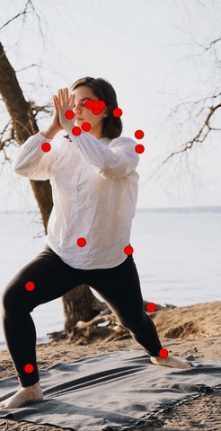

# MoveNet Sample

Sample project which integrates the NatML deep learning API with the NatDevice media device API for realtime pose detection.

## Setup Instructions
Retrieve your access key from [NatML Hub](https://hub.natml.ai/profile) and add it to your Project Settings. Note that fetching the MoveNet ML model from NatML Hub and using NatDevice requires an active [NatML Cloud](https://www.natml.ai/pricing) subscription:

## Requirements
- Unity 2020.3+

## Supported Platforms
- Android API level 24+
- iOS 13+
- macOS 10.15+ (Apple Silicon and Intel)
- Windows 10+ (64-bit only)
- WebGL:
    - Chrome 91+
    - Firefox 90+

## Resources
- Join the [NatML community on Discord](https://hub.natml.ai/community).
- See the [NatML documentation](https://docs.natml.ai/unity).
- See the [NatDevice documentation](https://docs.natml.ai/natdevice).
- Check out [NatML on GitHub](https://github.com/natmlx).
- Read the [NatML blog](https://blog.natml.ai/).
- Discuss [NatML on Unity Forums](https://forum.unity.com/threads/open-beta-natml-machine-learning-runtime.1109339/).
- Discuss [NatDevice on Unity Forums](https://forum.unity.com/threads/natdevice-media-device-api.374690/).
- Contact us at [hi@natml.ai](mailto:hi@natml.ai).

Thank you very much!